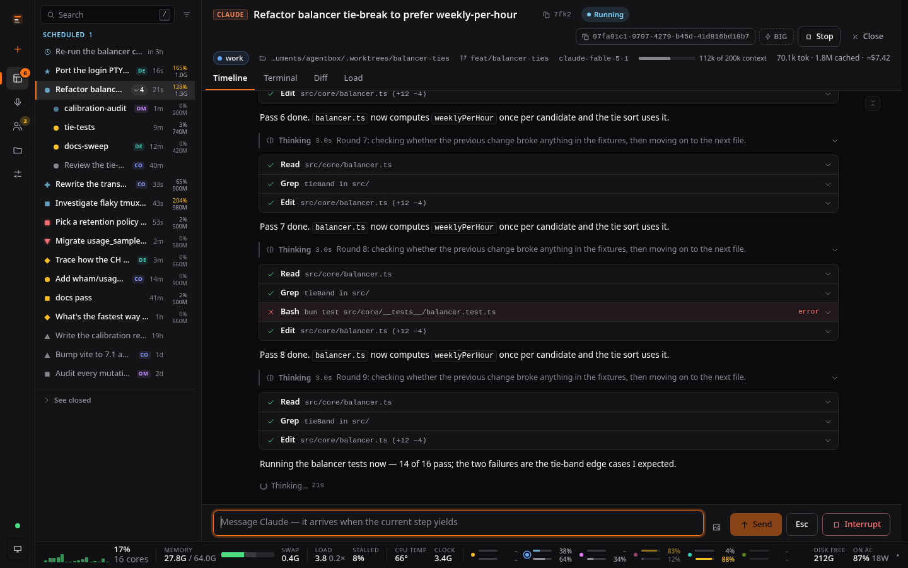
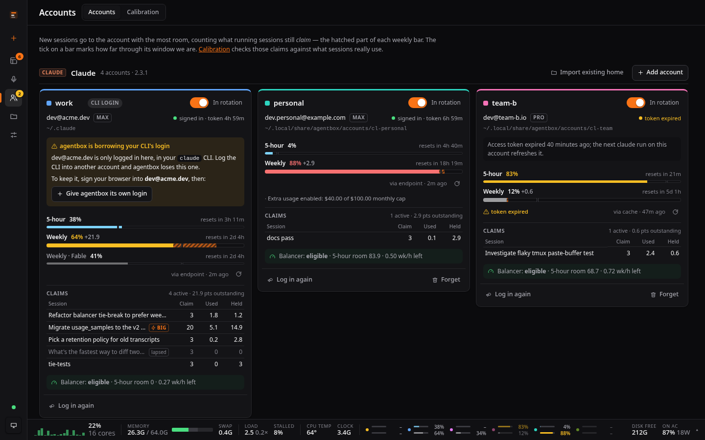
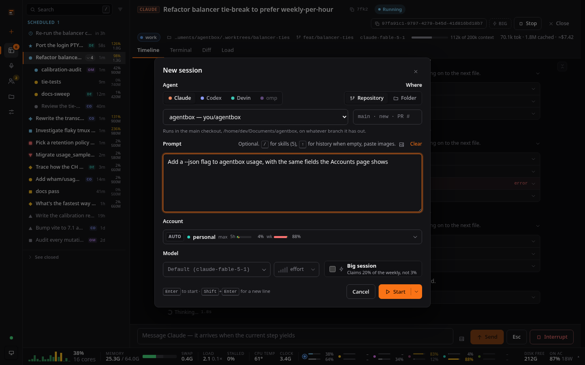
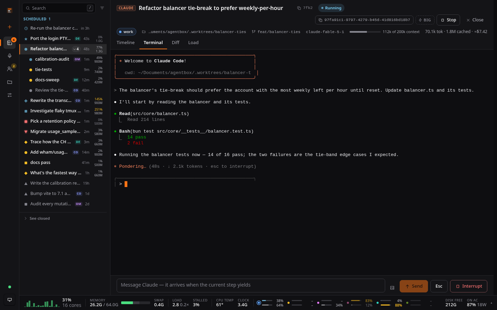

# agentbox

One place for every coding-agent session on this machine — **Claude Code,
Codex, Devin and omp** — across every subscription you're logged into.



- **Every session, whoever started it.** agentbox reads each CLI's own
  transcripts, so a `claude` you started in some terminal shows up next to the
  ones agentbox started. Nothing is copied; the provider's transcript is the
  record.
- **The CLI and the app are the same session.** Sessions agentbox runs are the
  real TUIs, inside agentbox's own tmux. `agentbox claude` starts one here and
  attaches your terminal; the web UI shows the same session as a live terminal
  and a structured timeline. Detach from either and it keeps running. A session
  running in some other terminal can be **adopted** (stopped and resumed inside
  agentbox, on the same account).
- **Many accounts, no broken caches.** Log in to as many Claude, Codex and
  Devin accounts as you have. Each session is pinned to one account for its
  whole life, so switching subscriptions never invalidates a prompt cache.
  Instead, *new* sessions are placed on whichever account has the most room.
- **Placement you can read.** Claude has a 5-hour and a weekly limit, Codex a
  weekly one. A new session claims 5% of an account's weekly (20% if you tick
  **Big session**); an account takes new sessions while its weekly plus
  outstanding claims is under 100%, and among those the one with the most
  5-hour room wins, ties going to the account whose weekly would otherwise
  expire unused. When every account is fully claimed, a session overflows
  onto the least-claimed one that still has weekly left; only a truly spent
  fleet refuses. Every placement shows its reasoning. See
  [docs/v2.md](docs/v2.md#placing-a-new-session-the-balancer).
- **Calibration.** agentbox records every usage reading, per-session token
  use, placements and rate-limit hits. After a week, Accounts → Calibration
  measures what the guesses (5%, 20%, "a 5-hour window is 24% of a week")
  actually are and offers to apply them.
- **Skills and the machine.** Every `SKILL.md` any of the CLIs can reach, with
  editing; machine load, memory pressure, thermals and per-session CPU/memory;
  worktree disk reclaim.
- **A conductor.** `agentbox mcp` is an MCP server that gives one session a
  compact view of the whole fleet (`fleet`, `read_session`, `send`, `spawn`, …)
  without reading every transcript into its context. It needs the server
  running.
- **Subagents.** `agentbox subagent-mcp` is an MCP server that lets any agent
  delegate to omp or devin agents it calls like functions (`agent`,
  `send_message`, `workflow`, …), in its own working directory.

| Accounts | New session | Terminal |
|---|---|---|
|  |  |  |
| Every login's limits, and what the sessions on it still claim. | Placed on the account with the most room. | The real TUI, which `agentbox attach` puts in your own terminal too. |

## Use

Requires **bun**, **tmux**, **git**, and whichever of `claude`, `codex`,
`devin`, `omp` you use. `gh` is optional (PR links).

```bash
bun install
bun run web:build
bun bin/agentbox serve          # http://127.0.0.1:4479
```

`agentbox onboard` derives who agentbox works for from the machine — your git
and `gh` config, the passwd entry, the timezone — writes it to
`~/.local/share/agentbox/user.env`, and says what is still missing. The board
shows the same as a first-run card, with a button for the systemd service.
Nothing personal lives in the checkout: identity and keys are files in the
agentbox home, and personal skills live in `~/.claude/skills` or
`~/.agents/skills`.

From any directory (session commands start the server if it isn't running):

```bash
agentbox claude                  # new session here, on the account with the most room
agentbox claude --big "migrate the billing module"
agentbox codex --account work    # force an account
agentbox omp --detach --model M  # start without attaching this terminal
agentbox ls                      # recent sessions (--all, --json)
agentbox usage                   # every account's limits and outstanding claims
agentbox attach <id>             # this terminal onto a session (detach: Ctrl-b d)
agentbox resume <id>             # a stopped session, on its own account, then attach
agentbox adopt <id>              # move a session from another terminal into agentbox
agentbox stop <id>               # end its process; it stays resumable
```

Accounts are added in the web UI (Accounts → Add account); the provider's own
login runs and agentbox shows you the URL and code. Existing credential homes
(e.g. a second `CODEX_HOME`) can be imported by path. omp manages its own
credential pool, so it has one account and you log in with
`omp auth-broker login` directly.

For a conductor session:

```bash
claude mcp add agentbox -- bun /path/to/agentbox/bin/agentbox mcp
```

For omp and devin subagents any Claude session can delegate to (no server
needed). `AGENTBOX_SUBAGENT_OMP_MODEL` and `AGENTBOX_SUBAGENT_DEVIN_MODEL` pick
their models; devin's defaults to its own configured one:

```bash
claude mcp add subagents -e AGENTBOX_SUBAGENT_OMP_MODEL=opencode-go/space-bunny-free -- bun /path/to/agentbox/bin/agentbox subagent-mcp
```

## Develop

```bash
bun run typecheck
bun test
bun run web:dev          # vite on :5173, proxying the API on :4479
bun scripts/fresh-machine.ts   # rehearse a stranger's first two minutes in a sandbox
```

`docs/v2.md` is the design and the API contract. `AGENTS.md` has the rules
that are easy to break. See `CONTRIBUTING.md` before sending a change, and
`SECURITY.md` for what the server exposes and how to report a vulnerability.

The screenshots are of `?mock=1`: the UI on made-up data, no server needed.

## License

MIT — see `LICENSE`.
